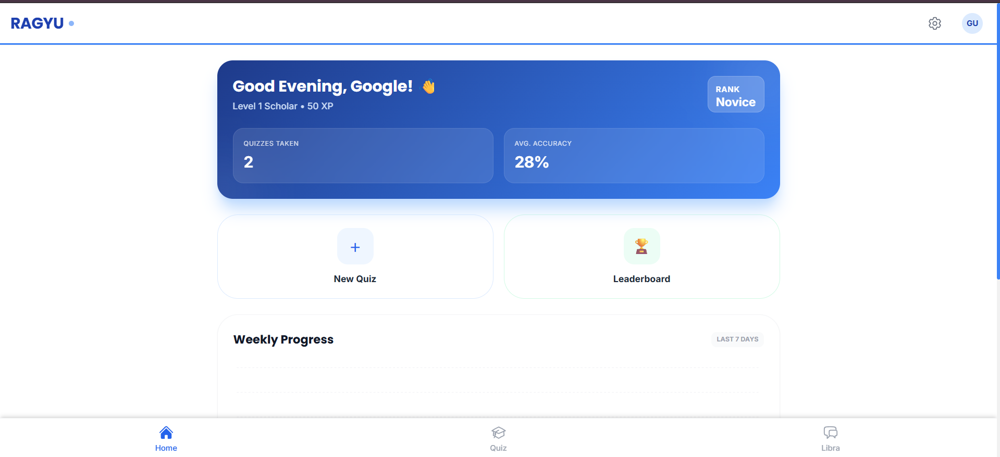
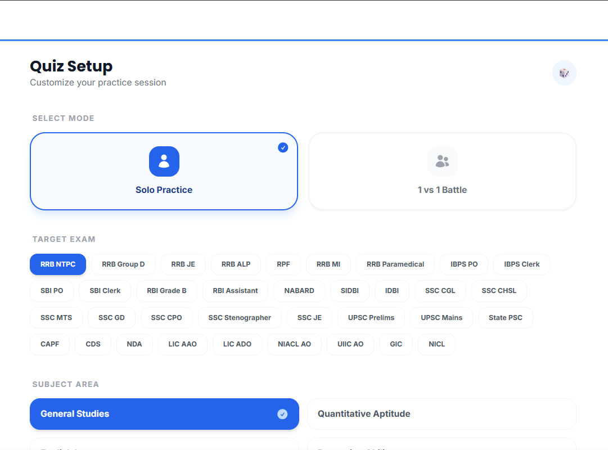
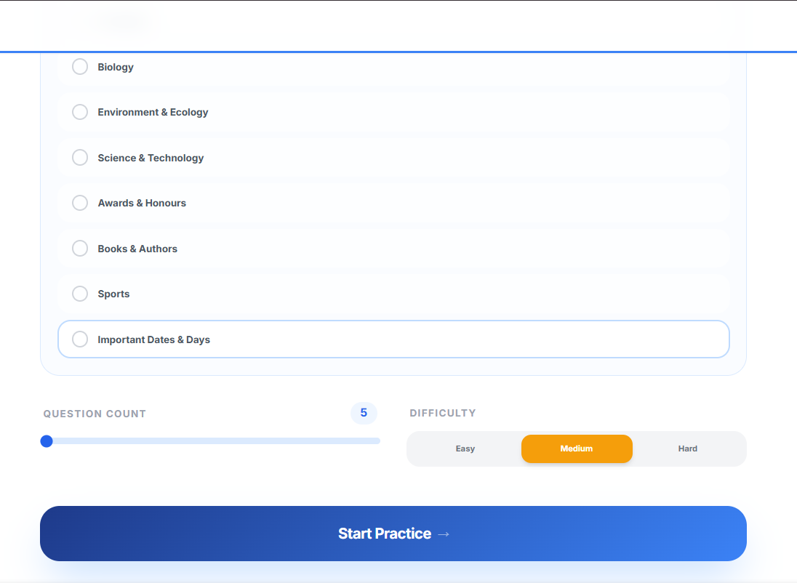
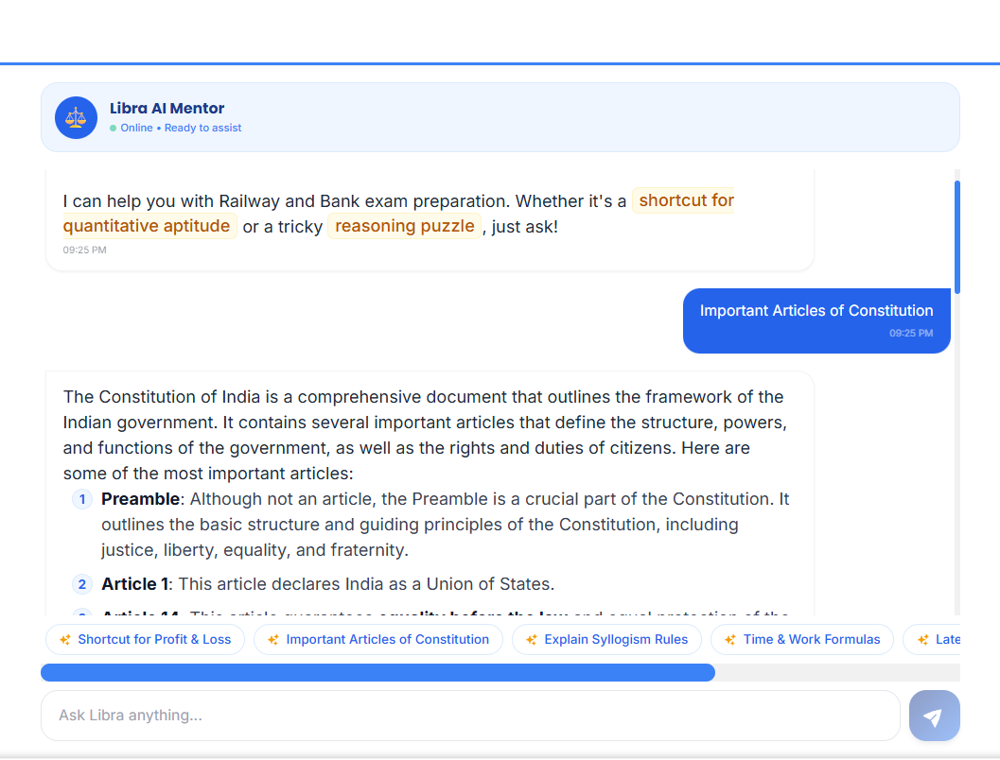
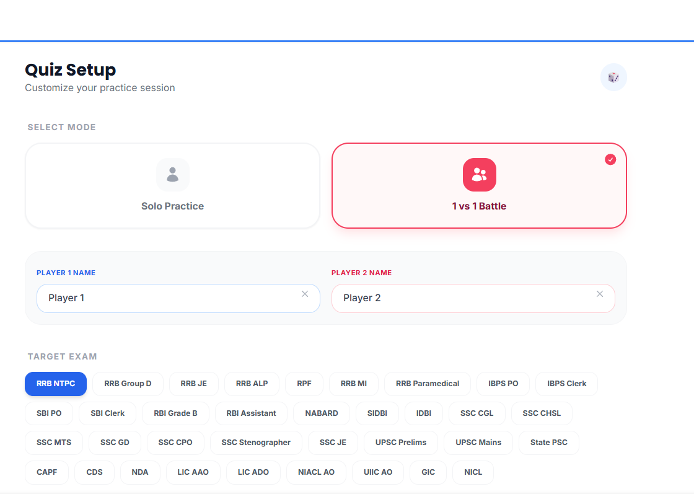
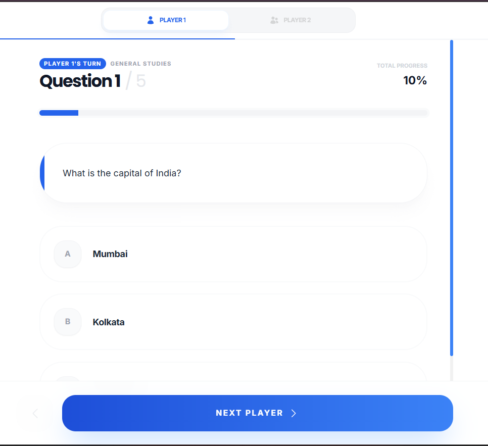
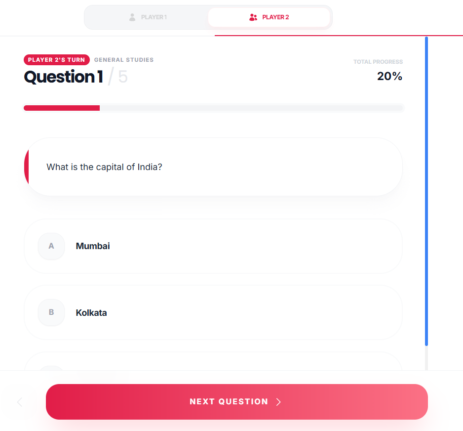
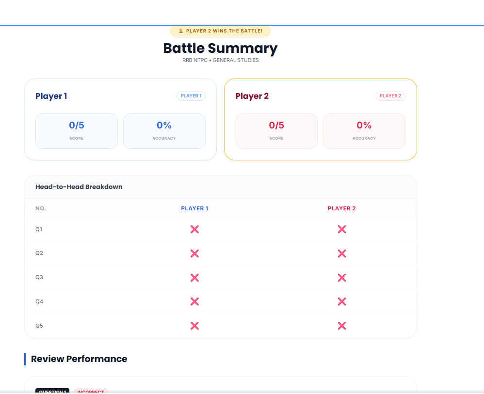
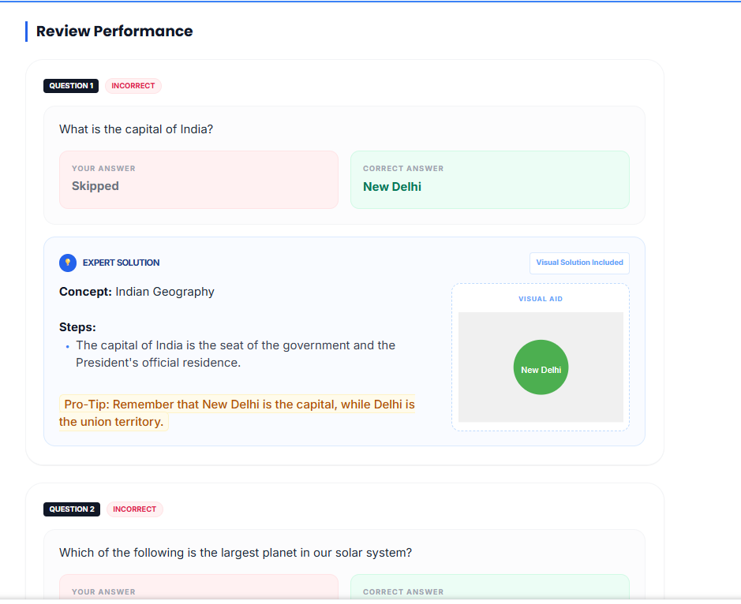

# 🎯 RAGYU - AI-Powered Government Jobs Preparation Platform

[](https://ragyu-ai-prep-with-java-backend.vercel.app/)
[](https://rohithdgrr.github.io/Protfolio/)
[](https://react.dev/)
[](https://www.typescriptlang.org/)
[](https://vitejs.dev/)

> **Your AI companion for cracking Indian Government Exams** - Railway (RRB), Banking (IBPS, SBI), SSC, UPSC, and Insurance exams.

---

## ✨ Features

### 🎨 Beautiful UI/UX
- Modern, responsive design with smooth animations
- Intuitive navigation and user-friendly interface
- Dark theme optimized for long study sessions

### 🤖 AI-Powered Learning
- **AI-Generated Questions** - Unique, contextual questions powered by Google Gemini & Mistral AI
- **Smart Question Tracking** - Intelligent system avoids question repetition for 7 days
- **AI Tutor (Libra)** - Your personal 24/7 study companion for doubt resolution
- **Visual Explanations** - SVG diagrams and visual aids for better understanding

### 📚 Comprehensive Coverage
- **5 Major Exam Categories** - Railway, Banking, SSC, UPSC, Insurance
- **40+ Specific Exams** - RRB NTPC, IBPS PO, SBI Clerk, SSC CGL, LIC AAO, and more
- **8 Subject Areas** - General Studies, Quantitative Aptitude, English, Reasoning, Computer Knowledge, Banking Awareness, Hindi, Static GK
- **500+ Subtopics** - Detailed syllabus coverage for complete preparation

### 🎮 Interactive Features
- **Multiplayer Mode** - Compete with friends in real-time quiz battles
- **Performance Analytics** - Track progress with detailed statistics
- **Instant Feedback** - Detailed explanations after each question

---

## 📸 Screenshots

### 🏠 Hero Dashboard

*Welcome to RAGYU - Your gateway to government job success*

### 📝 Exam Selection

*Choose from 5 major exam categories with 40+ specific exams*

### 📖 Subject Selection

*Select from 8 comprehensive subject areas*

### 🧠 Quiz Interface

*Interactive quiz experience with timer and progress tracking*

### 📊 Results & Performance

*Detailed performance analytics and progress tracking*

### 🤖 AI Tutor - Libra

*Your 24/7 AI study companion powered by advanced LLMs*

### 🎮 Multiplayer Mode

*Compete with friends in real-time quiz battles*

### 📚 Detailed Explanations

*Comprehensive explanations with visual aids*

### 🎯 Quiz Session

*Seamless quiz experience with instant feedback*

---

## 🛠️ Tech Stack

### Frontend
| Technology | Purpose |
|------------|---------|
| **React 19** | Modern UI library with latest features |
| **TypeScript** | Type-safe development |
| **Vite** | Lightning-fast build tool |
| **Tailwind CSS** | Utility-first styling |
| **Lucide React** | Beautiful icon library |

### Backend
| Technology | Purpose |
|------------|---------|
| **Java 17** | Robust backend language |
| **Spring Boot 3.2** | Enterprise-grade framework |
| **PostgreSQL** | Reliable relational database |
| **JWT** | Secure authentication |

### AI Integration
| Service | Usage |
|---------|-------|
| **Google Gemini AI** | Primary question generation |
| **Mistral AI** | Fallback AI service |

---

## 🚀 Quick Start

### Prerequisites
- Node.js 18+ 
- npm or bun
- Java 17+ (for backend)
- PostgreSQL 14+ (for backend)

### Installation

1. **Clone the repository**
   ```bash
   git clone https://github.com/Rohithdgrr/RAGYU-AI-PREP-WITH-JAVA-BACKEND.git
   cd RAGYU-AI-PREP-WITH-JAVA-BACKEND
   ```

2. **Install dependencies**
   ```bash
   npm install
   # or
   bun install
   ```

3. **Environment Setup**
   Create `.env.local` in the root directory:
   ```env
   GEMINI_API_KEY=your_gemini_api_key_here
   MISTRAL_API_KEY=your_mistral_api_key_here
   ```

4. **Start Development Server**
   ```bash
   npm run dev
   # or
   bun run dev
   ```

5. **Open in Browser**
   Navigate to `http://localhost:5173`

---

## 📦 Deployment

### Deploy to Vercel (Frontend)

1. Push code to GitHub
2. Connect repository to [Vercel](https://vercel.com)
3. Add environment variables in Vercel dashboard
4. Deploy automatically on every push

**Live Demo:** [https://ragyu-ai-prep-with-java-backend.vercel.app/](https://ragyu-ai-prep-with-java-backend.vercel.app/)

### Backend Deployment
See [backend/README.md](./backend/README.md) for detailed Spring Boot deployment instructions.

---

## 🎯 Available Scripts

| Command | Description |
|---------|-------------|
| `npm run dev` | Start development server |
| `npm run build` | Build for production |
| `npm run preview` | Preview production build |
| `npm run lint` | Run ESLint |

---

## 🏗️ Project Structure

```
RAGYU-AI-PREP-WITH-JAVA-BACKEND/
├── assets/              # Screenshots and images
├── backend/             # Spring Boot Java backend
├── components/          # React components
├── services/           # API service layer
├── App.tsx            # Main application component
├── constants.ts       # App constants & configuration
├── types.ts          # TypeScript type definitions
├── index.html        # HTML entry point
└── package.json      # Dependencies and scripts
```

---

## 🔐 Environment Variables

| Variable | Description | Required |
|----------|-------------|----------|
| `GEMINI_API_KEY` | Google Gemini AI API key | Yes |
| `MISTRAL_API_KEY` | Mistral AI API key | Yes |

Get your API keys from:
- [Google AI Studio](https://aistudio.google.com/app/apikey)
- [Mistral AI Platform](https://console.mistral.ai/)

---

## 🌟 Key Features Explained

### AI Question Generation
Our platform uses advanced AI models to generate unique, exam-relevant questions. Each question is tailored to specific exam patterns and difficulty levels.

### Smart Repetition Prevention
The intelligent tracking system ensures you won't see the same question for 7 days, maximizing learning efficiency and preventing rote memorization.

### Visual Learning
Complex concepts are explained with SVG diagrams and visual aids, making learning more engaging and memorable.

### Multiplayer Competition
Challenge friends in real-time quiz battles. Compare scores, climb leaderboards, and make learning social and fun.

---

## 🤝 Contributing

We welcome contributions! Please follow these steps:

1. Fork the repository
2. Create a feature branch (`git checkout -b feature/amazing-feature`)
3. Commit your changes (`git commit -m 'Add amazing feature'`)
4. Push to the branch (`git push origin feature/amazing-feature`)
5. Open a Pull Request

---

## 📞 Contact & Links

- **🌐 Live Website:** [https://ragyu-ai-prep-with-java-backend.vercel.app/](https://ragyu-ai-prep-with-java-backend.vercel.app/)
- **👨‍💻 Portfolio:** [https://rohithdgrr.github.io/Protfolio/](https://rohithdgrr.github.io/Protfolio/)
- **📧 GitHub:** [https://github.com/Rohithdgrr](https://github.com/Rohithdgrr)

---

## 📄 License

This project is licensed under the MIT License - see the [LICENSE](LICENSE) file for details.

---

## 🙏 Acknowledgments

- Thanks to Google Gemini AI and Mistral AI for powering our question generation
- Built with ❤️ for government job aspirants across India

---

<div align="center">

**Made with passion for cracking government exams** 🎯

[🌐 Live Demo](https://ragyu-ai-prep-with-java-backend.vercel.app/) • [👨‍💻 Portfolio](https://rohithdgrr.github.io/Protfolio/) • [📧 GitHub](https://github.com/Rohithdgrr)

</div>
